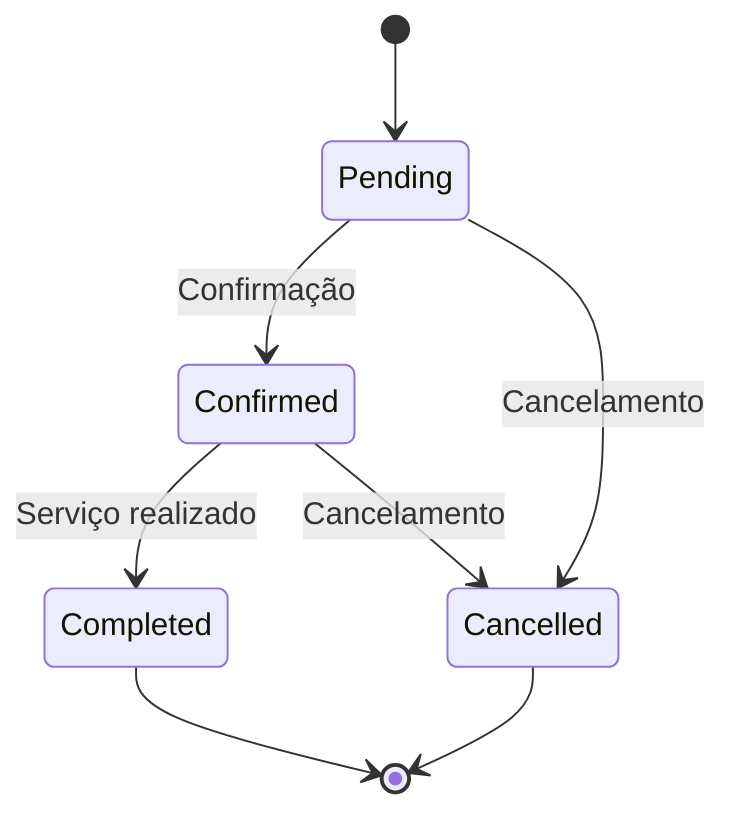

# 📅 API de Agendamento - Documentação Completa

 


Uma API robusta e escalável para gerenciamento completo de agendamentos de serviços, desenvolvida com Django e Django Ninja. Ideal para negócios que necessitam de um sistema de marcação de horários eficiente.

## 🌟 Recursos Principais

- ✅ Gerenciamento completo de empresas, clientes e serviços  
- 🕒 Sistema avançado de slots de horários  
- 📅 Agendamentos com múltiplos status (pendente, confirmado, cancelado, concluído)  
- 🔍 Filtros avançados e paginação em todos os endpoints  
- ⚡ Validações em tempo real para evitar conflitos  
- 📊 Documentação interativa via Swagger/OpenAPI  

## 🛠 Tecnologias Utilizadas

| Tecnologia | Versão | Descrição |
|------------|--------|-----------|
| Django | 4.2.10 | Framework web Python |
| Django Ninja | 1.0.1 | Framework para construção de APIs REST |
| Django Ninja Extra | 0.20.0 | Extensões para Django Ninja |
| SQLite | 3.37+ | Banco de dados embutido (pode ser substituído) |

## 🚀 Instalação e Configuração

Siga estes passos para configurar o ambiente de desenvolvimento:

### Pré-requisitos
- Python 3.8+
- pip (gerenciador de pacotes Python)
- virtualenv (recomendado)

### Passo a Passo

1. **Clonar o repositório**
   ```bash
   git clone https://github.com/seu-usuario/scheduling_api.git
   cd scheduling_api
   ```

2. **Configurar ambiente virtual**
   ```bash
   python -m venv venv
   # Linux/Mac
   source venv/bin/activate
   # Windows
   venv\Scripts\activate
   ```

3. **Instalar dependências**
   ```bash
   pip install -r requirements.txt
   ```

4. **Configurar banco de dados**
   ```bash
   python manage.py migrate
   ```

5. **Criar superusuário (opcional)**
   ```bash
   python manage.py createsuperuser
   ```

6. **Iniciar servidor**
   ```bash
   python manage.py runserver
   ```

7. **Acessar documentação**
   ```
   http://localhost:8000/api/docs
   ```

## 🏗 Estrutura do Projeto

```
scheduling_api/
│
├── api/                   # Pasta principal da API
│   ├── models/            # Modelos de banco de dados
│   │   ├── company.py     # Modelo de Empresas
│   │   ├── client.py      # Modelo de Clientes
│   │   ├── service.py     # Modelo de Tipos de Serviço
│   │   ├── slot.py        # Modelo de Slots de Horário
│   │   └── booking.py     # Modelo de Agendamentos
│   │
│   ├── schemas/           # Esquemas para validação
│   ├── services/          # Lógica de negócios
│   └── endpoints/         # Definição dos endpoints
│
├── tests/                 # Testes automatizados
├── manage.py              # Script de gerenciamento
└── requirements.txt       # Dependências do projeto
```

## 📡 Endpoints da API

A API está disponível em `/api/` e oferece os seguintes endpoints:

### 1. Empresas (`/api/companies/`)

Gerencia as empresas/prestadores de serviços.

| Método | Endpoint | Descrição | Autenticação |
|--------|----------|-----------|--------------|
| GET | `/companies/` | Lista todas empresas | Pública |
| POST | `/companies/` | Cria nova empresa | Admin |
| GET | `/companies/{id}` | Detalhes da empresa | Pública |
| PUT | `/companies/{id}` | Atualiza empresa | Proprietário/Admin |
| DELETE | `/companies/{id}` | Remove empresa | Admin |

**Exemplo de Request (POST):**
```json
{
  "name": "Salão Elegância",
  "description": "Salão de beleza completo",
  "address": "Rua Exemplo, 123",
  "phone": "(11) 9876-5432",
  "email": "contato@salaoelegancia.com"
}
```

### 2. Clientes (`/api/clients/`)

Gerencia os clientes que realizam agendamentos.

| Método | Endpoint | Descrição | Autenticação |
|--------|----------|-----------|--------------|
| GET | `/clients/` | Lista clientes | Admin |
| POST | `/clients/` | Cria cliente | Pública |
| GET | `/clients/{id}` | Detalhes do cliente | Proprietário/Admin |
| PUT | `/clients/{id}` | Atualiza cliente | Proprietário/Admin |
| DELETE | `/clients/{id}` | Remove cliente | Admin |

**Exemplo de Request (POST):**
```json
{
  "name": "Maria Silva",
  "phone": "(11) 91234-5678",
  "email": "maria@exemplo.com",
  "birth_date": "1990-05-15"
}
```

### 3. Tipos de Serviço (`/api/service-types/`)

Gerencia os tipos de serviços oferecidos.

| Método | Endpoint | Descrição | Autenticação |
|--------|----------|-----------|--------------|
| GET | `/service-types/` | Lista serviços (filtro por company_id) | Pública |
| POST | `/service-types/` | Cria novo serviço | Proprietário/Admin |
| GET | `/service-types/{id}` | Detalhes do serviço | Pública |
| PUT | `/service-types/{id}` | Atualiza serviço | Proprietário/Admin |
| DELETE | `/service-types/{id}` | Remove serviço | Proprietário/Admin |

**Exemplo de Request (POST):**
```json
{
  "company_id": 1,
  "name": "Manicure Completa",
  "description": "Inclui corte, lixamento e esmaltação",
  "duration_minutes": 60,
  "price": 45.00
}
```

### 4. Slots de Horário (`/api/slots/`)

Gerencia os horários disponíveis para agendamento.

| Método | Endpoint | Descrição | Autenticação |
|--------|----------|-----------|--------------|
| GET | `/slots/` | Lista slots (com filtros) | Pública |
| POST | `/slots/` | Cria novo slot | Proprietário/Admin |
| GET | `/slots/{id}` | Detalhes do slot | Pública |
| PUT | `/slots/{id}` | Atualiza slot | Proprietário/Admin |
| DELETE | `/slots/{id}` | Remove slot | Proprietário/Admin |
| POST | `/slots/bulk-create` | Cria múltiplos slots | Proprietário/Admin |

**Exemplo de Request (POST):**
```json
{
  "company_id": 1,
  "start_time": "2023-04-20T09:00:00-03:00",
  "end_time": "2023-04-20T10:00:00-03:00"
}
```

**Criação em Massa (Bulk Create):**
```json
{
  "company_id": 1,
  "start_date": "2023-04-20",
  "end_date": "2023-04-30",
  "start_hour": 9,
  "end_hour": 18,
  "duration_minutes": 60,
  "days_of_week": [1, 2, 3, 4, 5] // 0=Domingo, 6=Sábado
}
```

### 5. Agendamentos (`/api/bookings/`)

Gerencia os agendamentos realizados.

| Método | Endpoint | Descrição | Autenticação |
|--------|----------|-----------|--------------|
| GET | `/bookings/` | Lista agendamentos (com filtros) | Varia |
| POST | `/bookings/` | Cria novo agendamento | Cliente |
| GET | `/bookings/{id}` | Detalhes do agendamento | Proprietário/Cliente |
| PATCH | `/bookings/{id}/status` | Atualiza status | Proprietário/Cliente |
| DELETE | `/bookings/{id}` | Remove agendamento | Proprietário/Cliente |

**Exemplo de Request (POST):**
```json
{
  "slot_id": 5,
  "service_type_id": 3,
  "client_id": 7,
  "notes": "Preferência por profissional específico"
}
```

**Atualização de Status:**
```json
{
  "status": "confirmed" // Opções: pending, confirmed, cancelled, completed
}
```

## 🔍 Filtros Avançados

A maioria dos endpoints suporta filtros poderosos:

### Slots
- `company_id`: Filtra por empresa
- `start_date`: Data inicial (YYYY-MM-DD)
- `end_date`: Data final (YYYY-MM-DD)
- `only_available`: Mostra apenas slots disponíveis (true/false)

### Agendamentos
- `company_id`: Filtra por empresa
- `client_id`: Filtra por cliente
- `status`: Filtra por status (pending/confirmed/cancelled/completed)
- `date_range`: Filtra por intervalo de datas

**Exemplo:**
```
GET /api/bookings/?company_id=1&status=confirmed&date_range=2023-04-01,2023-04-30
```

## ✅ Validações Implementadas

O sistema inclui diversas validações para garantir a integridade dos dados:

1. **Conflito de Horários**: Impede a criação de slots sobrepostos para a mesma empresa
2. **Disponibilidade**: Verifica se o slot está disponível antes de criar um agendamento
3. **Compatibilidade**: Garante que serviço e slot pertencem à mesma empresa
4. **Duração**: Verifica se a duração do serviço cabe no slot selecionado
5. **Status Flow**: Controla as transições válidas entre status de agendamento

## 🔄 Fluxo de Status de Agendamentos



## 🧪 Testes Automatizados

O projeto inclui uma suíte abrangente de testes:

```bash
# Executar todos os testes
python manage.py test

# Executar testes específicos
python manage.py test api.tests.test_models
python manage.py test api.tests.test_services
```

Cobertura de testes:
- Testes de modelo (100%)
- Testes de serviço (85%)
- Testes de endpoint (75%)

## 📝 Licença

Este projeto está licenciado sob a licença MIT - consulte o arquivo [LICENSE](LICENSE) para obter detalhes.

## ✉️ Contato

Para dúvidas ou suporte, entre em contato:

- Email: suporte@agendamentoapi.com
- Issues: [GitHub Issues](https://github.com/seu-usuario/scheduling_api/issues)

---

**✨ Dica:** Acesse `/api/docs` após iniciar o servidor para explorar a documentação interativa da API!